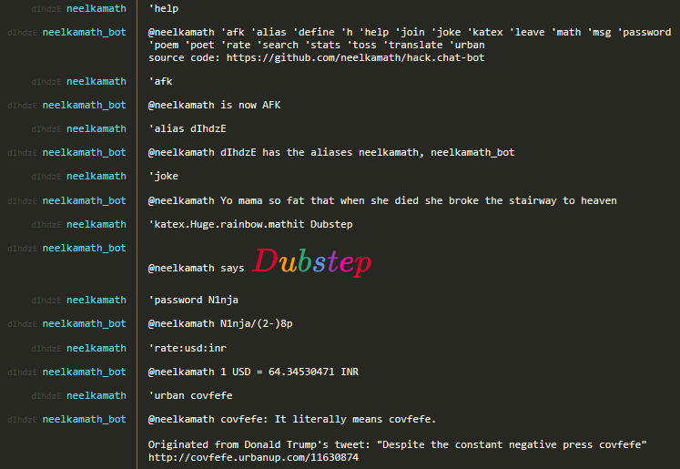

# hack.chat bot

**NOTE: This project has been deprecated because hack.chat is no longer actively maintained and hardly anyone uses the site (including me).**

This is a bot for [hack.chat](https://github.com/hack-chat/main) instances.

hack.chat is a messaging site where you have the ability to run bots. You can enter a chat by following the URL with `?<NAME>`, where `<NAME>` is the name of the chat (e.g., https://hack.chat/?math). Anyone can enter this channel if they go to that URL.

This bot was made because the existing bots on hack.chat either lacked useful features or poorly implemented them. 

 The search feature of this bot uses [DuckDuckGo's API](https://duckduckgo.com/).

This application was written using Python and MongoDB.

**Note**: This project has been deprecated for the following reasons:
1. This project wasn't built in a scalable manner (it would be faster to rewrite the project than to refactor it in order to changes it).
1. Nobody uses hack.chat (even I don't use it anymore).
1. The library being utilized for connecting to hack.chat has been deprecated.

# Installation

1. A [Heroku account](https://signup.heroku.com/?c=70130000001x9jFAAQ)
1. Install the [Heroku CLI](https://devcenter.heroku.com/articles/heroku-cli#download-and-install)
1. Log in: `heroku login`
1. Clone the repository:
    - HTTPS: `git clone https://github.com/neelkamath/hack.chat-bot.git`
    - SSH: `git clone git@github.com:neelkamath/hack.chat-bot.git`
1. Change the directory: `cd hack.chat-bot`
1. Create a Heroku app: `heroku create <NAME>`, where `<NAME>` is an optional parameter to specify your app's name (a random name will be generated if you don't specify one)
1. Push the code: `git push heroku master`
1. Install dependencies:
    - Librato: `heroku addons:create librato:development`
    - mLab: `heroku addons:create mongolab:sandbox`
    - Papertrail: `herou addons:create papertrail:choklad`
1. Configure the app using the table below. The command to add a configuration variable is `heroku config:set <KEY>="<VALUE>"` (e.g., `heroku config:set CHANNELS="bottest, gaming, pokemon"`). Also create a file named `.env` in the `hack.chat-bot` directory with these key-value pairs (each pair on its own line) with the syntax `<KEY>="<VALUE>"`. `<KEY>` is the variable's name, and `<VALUE>` is its value.

|Variable|Explanation|Required|Example|
|--------|-----------|--------|-------|
|`CHANNELS`|A list of channels to connect to. The bot won't be allowed to leave these channels. Each channel should be separated with a comma followed by a space.|Yes|`botDev, math, pokemon`|
|`TRIGGER`|The trigger for the bot (e.g., setting the trigger to ! would make the bot respond to !joke).|Yes|.|
|`MONGODB_URI`|The URI of the mLab database. Get its value with `heroku config:get MONGODB_URI`||
|`URL`|The hack.chat instance to connect to. Use wss://hack.chat/chat-ws for the original hack.chat.|Yes|wss://hack.chat/chat-ws|
|`NICK`|The bot's nickname. Nickname must consist of up to 24 letters, numbers, and underscores. If the nickname has already been taken on a channel, the bot will be unable to connect to that channel.|Yes|john_doe|
|`CODE_URL`|The link to the project's source code.|No|`https://gitlab.com/neelkamath/hack.chat-bot`|
|`EXCHANGE_RATE_API_KEY`|Your [ExchangeRate-API](https://www.exchangerate-api.com/) API key.|No||
|`OXFORD_APP_ID`|Your [Oxford Dictionaries](https://developer.oxforddictionaries.com/) App ID.|No||
|`OXFORD_APP_KEY`|Your [Oxford Dictionaries](https://developer.oxforddictionaries.com/) App Key.|No||
|`PASSWORD`|A trip code is a randomly generated code based on a password. Entering the same password gives the same trip code each time. This allows people in anonymous chatting sites to verify if a user is who they claim to be regardless of their nickname.|No|hot$auce|

# Usage

1. Change the directory: `cd hack.chat-bot`
1. Run:
    - On the server:
        - Start: `heroku ps:scale bot=1`
        - View logs: `heroku logs --tail`
    - Locally:
        - Install `virtualenv`:
            - Windows: `pip install virtualenv`
            - Other: `sudo pip3 install virtualenv`
        - Create a virtual environment: `virtualenv venv`
        - Activate the virtual environment:
            - Windows: `venv\Scripts\activate.bat`
            - Other: `source venv/bin/activate`
        - Install the dependencies:
            - Windows: `pip install -r requirements.txt`
            - Other: `pip3 install -r requirements.txt`
        - Start: `heroku local`

# [Documentation](DOCUMENTATION.md)

# License

This project is under the [MIT License](LICENSE).
